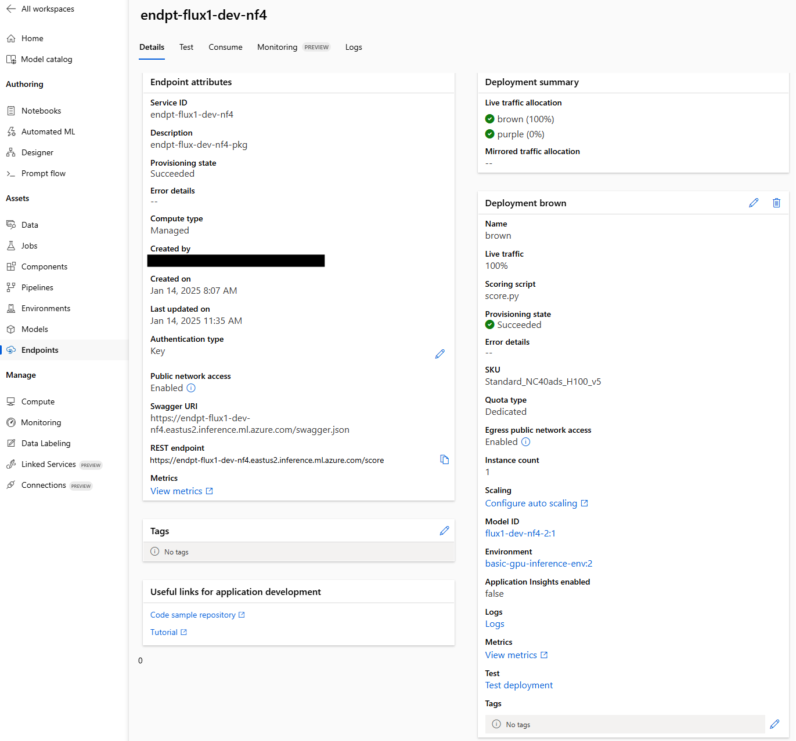

# Task 1 : Deploy an open source HuggingFace model in AzureML

## Task description

Deploy FLUX.1 Dev NF4 as a real-time Managed Endpoint for inferencing on Azure ML.

## Motivations
- Playing with HuggingFace (HF) models on a local machine is fine, but how to serve this model perhaps privately within a studio or enterprise setting? Try this, I set about deploying this within an Azure test account.
- the HF model I needed was FLUX.1-dev NF4, but that is not available in the Azure ML Model Catalog, which would have been very convenient. So I had to find some way to load that model from HF.
- I wanted to script everything, but as you'll see I had to default to the Azure ML Portal for deployment. I will continue troubleshooting the scripted approach.
- I wanted to get up and running asap and my python (among other things) ain't too hot, so I used Copilot. A lot.

## Overview

1. Set up Azure ML
2. Set up FLUX.1-Dev NF4 ("Flux NF4" for short) for upload to Azure ML
3. Create Azure ML Environment
4. Write scoring script
5. Create Endpoint and Deployment
6. Test

## 1. Set up Azure ML

Follow instructions from learn.microsoft.com to set up an Azure ML workspace in an Azure Subscription.
Some notes
- GPU compute quota is needed for this model. CPU works in theory, but is in practice way too slow
- Check which GPU SKUs are allowed for Managed Endpoints from [this page](https://learn.microsoft.com/en-us/azure/machine-learning/reference-managed-online-endpoints-vm-sku-list?view=azureml-api-2). For instance, A10 GPUs are not supported. I requested Standard_NC40ads_H100_v5, which I found to be a good balance of price/performance for my specific needs.
- Ensure GPU has enough VRAM. I selected Flux.1 dev NF4 which is a quanitized model that's ~9GB (vs regular ~30GB) in size which will fit any valid GPU's VRAM
- Security notes - to be completed.

## 2. Set up FLUX NF4 for upload, upload & register model

References: download_and_save_model.py, upload_register_model_saved.py

Flux.1-Dev NF4 consists of multiple components and not just a single model weights file, as many of the tutorials seemed to assume:
- 1 transformer (the Flux model itself)
- 2 CLIP (Contrastive Language-Image Pair) text encoder models
- 2 tokenizer models
- 1 variational autoencoder (vae)
- scheduler

There are a few ways to deal with this but one way is to load the model using FluxPipeline.from_pretrained() with the correct parameters, then save it out to a subdirectory on disk with FluxPipeline.save_pretrained(). Here, I saved it to "./saved_model". Before saving, run a test generation locally that outputs a PNG file. 

Now, FLUX is a gated model, meaning it is openly accessible, but you need to login to HF first, i.e. no anonymous access. So you need an HF account first of all.
Then, install the Hugging Face CLI:

    # pip install huggingface_hub
    
Then login to it with an Access Token you generate in your account:

    # huggingface-cli login

Another way that is similiar, is to utilize the FluxPipeline cache. When a model is loaded, FluxPipeline caches the model in either a default subdirectory or one specified by the user. That cache directory could also be uploaded to AzureML, but the structure created in the cache is not as intuitive as that of the save_pretrained method, so I prefer the former way out of these two.
   
Next, in python, configure an Azure MLClient with the right credentials, subscription, etc. and from there, create a registered model. 

The only wrinkle here is that by default, the AzureML workspace's storage account was set up with key-based authentication disabled. But I was working from a local machine and could not get a Managed Identity for it (I guess the assumption is that the user would be working from an Azure VM?) so had a specifically enable key auth on the storage account for this to work.

One other learning is that models created with the "v1" API from the azureml library are not compatible with "v2" API using the azure.ai.ml library. Found out the hard way through code suggested by Copilot, when I didn't specify which version it should use.

## 3. Create Azure ML Environment

Reference: create_environment.py

There are several ways to create an Azure ML Environment, including using either curated or custom environments, etc. and either through the Portal or programmatically. I chose the latter.

First, I found in the Microsoft image repo a base image for GPU inferencing: mcr.microsoft.com/azureml/minimal-ubuntu22.04-py39-cuda11.8-gpu-inference:20241216.v1. The presence of the Nvidia CUDA driver is key.

I created a config.yml file for conda, including the required libraries for the Flux NF4 model. Pinning the version numbers is important if you don't want mysterious model crashes. Note - I'm not sure where I missed it in the docs, but doing it this way I had an environment container crash because it lacked "azureml-inference-server-http" in the conda config file, and had to add it manually for it to work.

The script then takes all of these arguments and an environment definition in Azure ML as opposed to an actual environment. The actual environment build gets triggered with the deployment job as you'll see later. Or, if you really wanted to you could manually force a build in the Azure ML Portal Environment page.

## 4. Write scoring script

Reference: ./scripts/score.py

To create the endpoint, a scoring script- one that loads the model and handle inferencing requests.p must be supplied. (Side note, Azure ML uses Flask as the default app framework foor this script.) 

The generic scoring script template was modified to include the HF libraries for FluxPipeline and libraries for image manipulation. The now-familiar FluxPipeline.from_pretrained() loads the model from a concatenation of the fixed AZURE_MODEL_DIR location within the container, and "saved_model" which is the subdirectory from step 1.

The generated image was then saved in PNG format and sent as a response, along with the appropriate http mime type. 

At this stage you'll just have to take my word that the script works. I will improve this by adding some way to first test it locally.

## 5. Create Endpoint and Deployment

Reference: NOTE- create_environment.py DOES NOT WORK and I'm still trying to figure out why. It will deploy successfully, but the resulting endpoint will return 408 for some reason, and there seems to be nothing in the logs to suggest why it is timing out. I realize that as part of the Portal deployment method, there is a configuration line for "timeout" set to 60 sec, whereas the logs seem to suggest it's set to 5 sec when deployed by script. Definitely going to pull on that thread.

However, for now I have got it working by deploying via the Portal. So in ml.azure.com, in the Workspace > Environments page, create an Endpoint and Add deployment. Fill in all the tabs for the deployment configuration, specifying the Model (which should already be registered; pay attention to the version number), Environment and deployment name. Finally, specify the compute SKU, GPU based. I set the instance count to 1 since this is just a test, but you'll need more for redundancy and scale, of course. 

Then hit create, and wait while it deploys. This can take a while depending on model and environment sizes.

Here is the final output when all is done.

## 6. Test 

Reference: requests.http

First you can test the endpoint from within the Azure ML Portal, under the Test tab. It will return binary, but at least hopefully it returns something. 

Using the REST Client extension in VSCode, I added the Auth Key to a POST call with the configuration as seen in the Json payload.
I got back this lovely image:

Prompt: "_She wore a raspberry beret, the kind you find in a second-hand store._"

Mission accomplished... for now.

## Improvements 

This is just a log of my first attempts, and by no means what "good" looks like. 
I intend to make improvements, which will be detailed in this project's backlog (tbd).

## Lessons learned

To be completed... so, so much...

