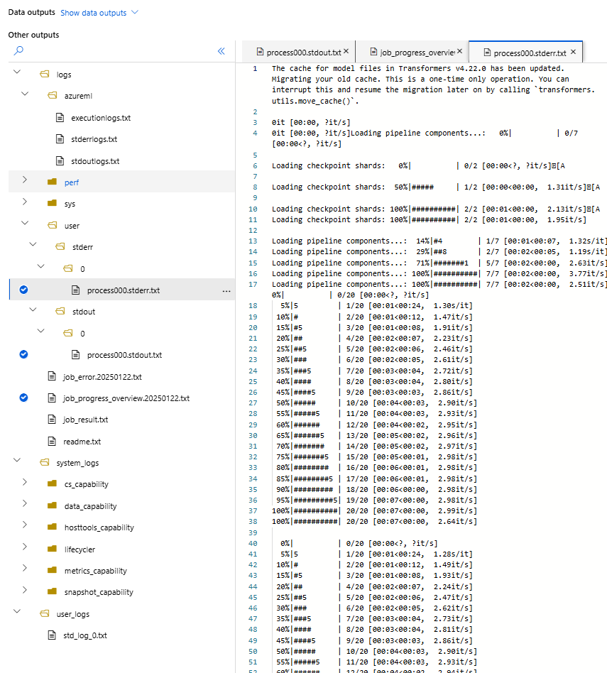
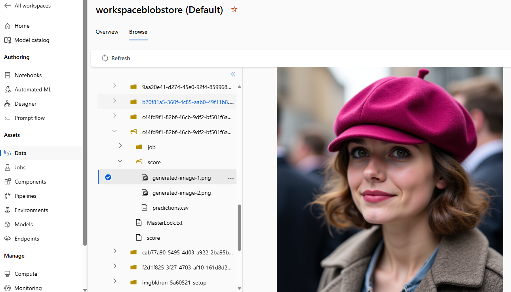
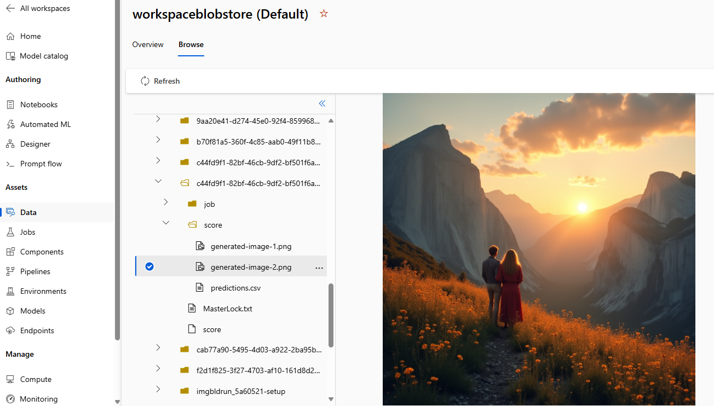

# Task 2 : Deploy an open source HuggingFace model with AzureML Batch Endpoint

## Task description

Deploy FLUX.1 Dev NF4 as a batch inference endpoint on Azure ML.

This follows Task 1 where FLUX.1-Dev NF4 was deployed as a real-time endpoint. This time, trying the Batch Endpoint functionality. 
To be expedient, these steps will assume Task 1 has been done. Down the road I plan to revise this to be a stand-alone module.

## Motivations
- Since the online endpoint was deployed successfully, naturally I wanted to see what the corresponding Batch experience was like.
- To ensure consistency, as many parameters were preserved as possible - model, data, environment, scripts, etc.
- Again, to be consistent, I used the Python SDK v2 for azure.ai.ml. with the "aid" of Github Copilot. I use quotes because it wasn't always helpful - see lessons learned.

## Overview

1. Set up Azure ML
2. Prepare data
3. Prepare model & environment - re-use from Task 1
4. Create batch scoring script
5. Create batch deployment
6. Test: perform a batch inference

## 1. Set up Azure ML

Follow instructions from learn.microsoft.com to set up an Azure ML workspace in an Azure Subscription.
Some notes
- GPU compute quota is needed for this model. CPU works in theory, but is in practice way too slow
- Check which GPU SKUs are allowed for Managed Endpoints from [this page](https://learn.microsoft.com/en-us/azure/machine-learning/reference-managed-online-endpoints-vm-sku-list?view=azureml-api-2). For instance, A10 GPUs are not supported. I requested a few cores worth of `Standard_NC40ads_H100_v5`, which I found to be a good balance of price/performance for my specific needs.
- Ensure GPU has enough VRAM. I selected Flux NF4 which is a quanitized model that's ~9GB (vs full-fat Flux Dev which is ~30GB) in size which will fit any valid GPU's VRAM
- Security notes - to be completed.
- A `config.json` file was used to contain all the secrets locally.

## 2. Prepare data

References: `./data ,  prep_data.py`

In this exercise, we assume that requests for image generation come in from some app outside the scope of this Task. They come in as separate json files as seen in the `./data` directory here, where there are two such example files. These files are then registered as Data Assets in the Azure ML workspace under the name `ti2gendata`, using `prep_data.py`.

The usual MLClient is first created, in my case with a Service Principal. 

Then, because I have a directory of files that I want ingested as the Data Asset, I set `data_path` to `./data`, and specify `type=AssetTypes.URI_FOLDER` for the `Data` object. The alternative would have been to just ingest a single large file which contains multiple requests and then use  `AssetTypes.URI_FILE` instead, but I chose what I chose.

The rest is straightforward; a call to `create_or_update()` takes care of the upload. You can then view the Data Asset in the Azure ML Portal. 
Multiple uploads of the same name will result in the version number getting incremented, which is important, because you want to infer against the correct version later on. So take note of that.

## 3. Prepare model & environment - re-use from Task 1

As mentioned, I re-use artifacts from Task 1:
- the Flux NF4 model already registered, called `flux1-dev-nf4-2`, version 1. 
- the GPU inferencing environment called `basic-gpu-inference-env`, version 4. 

Of course, your versions may vary.

## 4. Create batch scoring script

Reference: `./scripts/batch_score.py`

The batch endpoint basically takes whatever input you give it, and then dumps out the scoring results in a Pandas dataframe. This works for most other applications, and indeed most examples I saw on learn.microsoft.com show the inferencing operation returning text results in a csv file. 

However, I will be generating images from each input file and it's not best practice to stuff them into a dataframe. I mean, you could, since practically the GPU VM SKUs tend to come with a lot of RAM anyway. But the more elegant solution is to save out each image to a storage blob under a unique name, and then append the location of those images to the resulting text file.

To do this, I modified the scoring script from Task 1:
- during the `init()`, set up a global output path from the environment variable `AZUREML_BI_OUTPUT_PATH`, where 'BI' stands for 'Batch Inference'. This is where we will deposit all generated images. (I had to seriously hunt for this one, before I found it right there in the docs. I _really_ wish there was one reference page listing all environment variables available within a compute VM.)
- create the unique filename that uses the index number of the request. NOTE there is a bug in this one which I'll fix later - it assumes there's only going to be one mini-batch of requests. If there are more than one, the generated files will get overwritten. A better way would perhaps be to use a random guid as part of the filename.
- As mentioned, append the output path of each image generated into `results[]`, that will eventually get returned.

As with Task 1, I need to find a way to test this locally before deploying... stay tuned.

Also, I haven't figured how to get logging working properly yet, in my case, all those log outputs seem to appear nowhere in the logs. Hmmm.

## 5. Create batch deployment

Reference: `create_batch_deployment.py`

After the usual rigmarole to create an MLClient, I muster an `Amlcompute` clusters using the trusty old `Standard_NC40ads_H100_v5` SKU, setting a max cluster size of 1 (after all I'm just testing) and minimum 0, to save $$$ when not in use.

Then it's a matter of creating a batch endpoint called `flux-nf4-batch`, specifying the model and environment, and then configuring a `ModelBatchDeployment`. I specified the `output_action=BatchDeploymentOutputAction.APPEND_ROW` which will, as it promises, append each image output path returned from the scoring script, into the final output file. And because I don't specify `output_file`, it will come out as the default `predictions.csv`.  All other configuration values were copy-pasted from examples, although I did set `instance_count` to 1 because I knew that's all I have in my cluster anyway.

Finally, kick off the deployment with `create_or_update()`. Once done, the deployment isn't actually set up yet, only an inferencing call to the endpoint will start it up. Since it's batch endpoint, it's only brought up when it is needed.

## 6. Test: perform a batch inference

Reference: `infer_batch.py`

Finally, this script kicks off a batch inference Job in Azure ML. It should be quite easy to follow the logic flow.

Again, the python script will terminate, but in Azure ML portal you can watch the job start, and track it's progress there. 

I found these logs (the ones with check marks beside them) particularly useful in troubleshooting:

It took a while for these logs to appear during each run, as the app only starts running after a full container image build, which in my case took about 12 minutes each time. Again, this is a batch endpoint, so you're not supposed to care how long it takes. 

At the end of the run, I took the name of the Job, which is a guid, and used that to browse the Datastores to find the generated images in the Azure ML Portal. 

Here's what I got:

Prompt: "She wore a raspberry beret, the kind you find in a second-hand store."

Prompt: "In a big country, dreams stay with you, like a lovers voice fires the mountain side."

## Lessons Learned
TODO

## Improvements
TODO